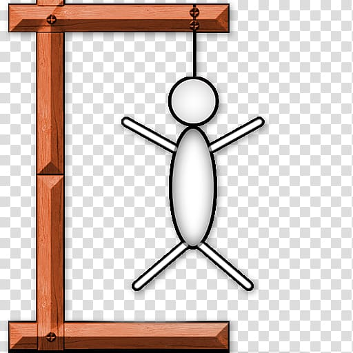

# 🎉 **Welcome to Hangman Madness!** 🎉



🚀 **Version:** 1.0  
👨‍💻 **Author:** Shay Aviv  
📅 **Last Updated:** August 2024

---

## 🕹️ **What is Hangman Madness?**

**Hangman Madness** is a bold, creative, and hilariously fun take on the classic word-guessing game we all know and love! Dive into the world of ASCII art, witty banter, and the thrill of guessing the right word before your little stick figure friend meets his untimely end!

---

## ✨ **Features**

- 🎨 **Stylish ASCII Art**: Watch as your stickman gradually materializes (or not!) based on your guesses.
- 🧠 **Mind-Boggling Word Challenges**: With a custom word selection mechanism, no two games are ever the same.
- 😎 **Cheeky Feedback**: Incorrect guesses? Be ready for some playful roasting!
- 🎯 **Interactive Gameplay**: Real-time feedback on your progress, keeping the tension high.

---

## 📋 **How to Play?**

1. **Enter your name** to get a personalized greeting.
2. **Select a word** from a text file by providing the file path and index.
3. **Start guessing letters** and watch your stickman grow!
4. **Win** by guessing the word before the stickman is fully drawn.
5. **Lose** and get taunted, but don’t worry—you can always try again!

---

## 🔧 **Installation Instructions**

1. **Clone the repository**:
   ```bash
   git clone https://github.com/ShayAviv/HangMan.git

## 🔥 **Wanna Check Out the Code?**

[](https://github.com/ShayAviv/HangMan/blob/main/HangMan.py)

---

## 🤝 **Contributing**

Feel free to fork this project, add your own twist, and send a pull request. Let’s make this the wildest Hangman game on GitHub!

---

## 🏆 **Credits**

Big thanks to **Campus IL**, inspired me to undertake a project on the "self.py" course, awarding me a certification for my efforts.

---

## 📬 **Contact**

Have questions? Want to collaborate? Reach out to me via [Linkedin](https://www.linkedin.com/in/shayaviv/).

---

## ⭐ **Don’t Forget to Star the Repo!**

If you enjoyed the game, please give it a ⭐ on [GitHub](https://github.com/ShayAviv/HangMan)!

---

## 📜 **Certification**

I received a certification for completing the "self.py" course. You can view and download the certification [here](https://courses.campus.gov.il/certificates/8ec0ea5dd07b4ec5b93c04c763a3ca64).

---

Enjoy playing and may the guessing gods be ever in your favor! 🎮💥
